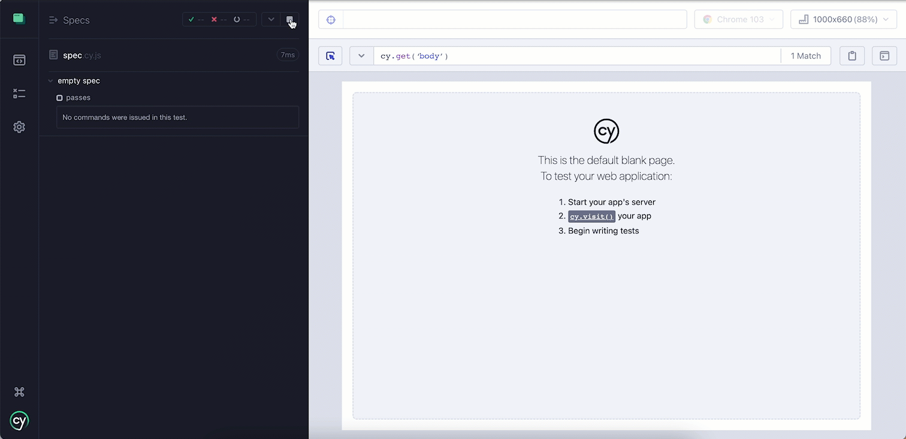

# コンテキストとセマンティクスを意識して<br>リーダブルなE2Eテストコードを書こう

## Takuya Suemura @ Autify, Inc.

---

# おれは誰だぜ

## 末村 拓也

開発者、フィールドエンジニア、QAなどを経て、2019年にAutifyに入社。
自動テスト、特にWebのE2Eテストに強い。
現職ではテクニカルサポートを担当。テスト対象とテストフレームワークの互換性の問題などを調査、解決する役割を担う。

テトリスが好き。

---

# おれが今まで話してきたこと

JaSST'22 Tokyo 60分で学ぶE2Eテスト (ベリサーブ 伊藤由貴さんと共演)
https://github.com/tsuemura/jasst22-tokyo

JTF2020 テストを自動化するのをやめ、自動テストを作ろう
https://speakerdeck.com/tsuemura/tesutowozi-dong-hua-surufalsewoyame-zi-dong-tesutowozuo-rou

<hr>

「E2Eテストとはなにか」「理想的なE2Eテストの書き方とは」を
ひたすら考えたり話したりし続けている人です

---

# 今日話すこと

- そもそもE2Eテストってどういうものだっけ？
- E2Eテストをリーダブルにする理由は？
- どうやってリーダブルにするの？

<!--
2:00
 -->
---

# そもそもE2Eテストとは

---

# よくあるE2Eテストのイメージ

ブラウザとかモバイルデバイスを自動操作して
WebアプリとかモバイルアプリのUIを
ユーザーが操作するのと同じようにテストする

---



---

# (Webの) E2Eテストで用いられる技術

- Webブラウザの自動操作技術
  - Selenium, Cypress, PlayWright etc.
- 要素特定の手段
  - CSS Selector, XPath etc.

---

# E2Eテストの例

Cypressによる擬似コード

```js
/** ログインする **/

// メールアドレスを入力
cy.type('input[name=email]', 'foo@example.com')
// パスワードを入力
cy.type('input[name=password]', 'pass1234')
// 送信ボタンをクリック
cy.click('input[type=submit]')
```

この例では **CSSセレクタ** で要素を特定し、
それらをクリックしたり、文字を入力したりしている

---

# E2Eテストをリーダブルにする理由は？

---

# E2Eテストをリーダブルにする理由は？

**＝（脳の）メモリの無駄遣いを防ぐ**

E2Eテストコードは次のようなことを *想像* しながら読まないといけない

- 長いテストコードを最初から読みながら
- 今どのページにいるのか想像しながら
- どのボタンを押しているのか想像しながら

*想像をなるべく減らす* のがポイント

---

# 読みにくいUI操作の例

```js
// 送信ボタン
cy.get('button[type="submit"]').click()

// 「OK」ボタン
cy.get('button.primary').click()
```

どちらも **CSSセレクタ** を用いて要素を探索しているが……

- `type="submit"` が送信ボタンであることを知っているのは **エンジニアだけ**
- `primary` クラスがOKボタンに当たってるのは **ただの実装上の都合**
- ユーザーは `type="submit"` や `.primary` のような内部的な属性値を使わず、 **ラベル** で探す

読みにくいだけでなく、ユーザー目線でもないので、誰の得にもならない

---

# 読みにくいシナリオの例

```js
cy.get('input[name="email"]').type('foobar@example.com')
cy.get('input[name="password"]').type('pass1234')
cy.get('button[type="submit"]').click()
```

このページは ログイン ? それとも 新規登録 ?

---

# 読みにくいシナリオの例

```js
// 新規登録ページにアクセス
cy.visit('/register')

cy.get('input[name="email"]').type('foobar@example.com')
cy.get('input[name="password"]').type('pass1234')
cy.get('button[type="submit"]').click()
```

直前で「新規登録ページにアクセスした」という **文脈** が無いと読み解けない

---

# ここまでのまとめ

- 想像で読む部分を減らしたい、そのために
  - ユーザーが要素を探すときと同じ方法で要素を探したい
  - 文脈に依存する書き方を減らしたい

<!-- 6:20 -->
---

# どうやってリーダブルにするの？

---

# どうやってリーダブルにするの？

- **セマンティック**な書き方を用いる
  - ユーザーにとって意味のある書き方を用いる
- **コンテキスト**を明示する
  - 「今何をしているのか」「今どこにいるのか」を明確にする

---

# 読みにくいUI操作の例（おさらい）

```js
// 送信ボタン
cy.get('button[type="submit"]').click()

// 「OK」ボタン
cy.get('button.primary').click()
```

どちらも **サイトの内部構造** を用いて要素を探索しており
**ユーザー目線** ではない

意味のある = セマンティックな書き方 を使おう

---

# セマンティックな書き方の例

1. 文言を用いる
2. サイトのアクセシビリティを用いる

---

# 1. 文言を用いる

Cypress では文言を用いたセレクタを使える
以下の例では `Sign Up` という文言を含む要素をクリックする

```js
cy.contains('Sign Up').click()
```

※ 複数見つかった場合、一番最初に見つかった要素をクリックしてしまうので注意

---

# 文言だけでは出来ないケースはどうしたら？

例: ハンバーガーメニューのアイコン

例: あるラベルを持つ入力フォーム

例: 画像

---

# Testing Library を使ってみよう

[Testing Library](https://testing-library.com/)

要素の 役割 や ラベル などを用いてテストコードを書くためのライブラリ

```js
// 例
getByRole("textbox", {name: /メールアドレス/})
```

---

# Testing Library を使わない場合

```js
// span タグを用いて作成した擬似的な Submit ボタン
<span role="button">Submit</span>

// button タグを用いて作成した Submit ボタン
<button>Submit</button>
```

この2つは `button` という role と `Submit` という `name` を持つ

意味的にはほぼ等価だが
テストフレームワークからは異なるセレクタを使わなければいけない

```js
cy.get('span').contain('Submit')
cy.get('button').contain('Submit')
```

---

# Testing Library を使う場合

Testing Library を使うとどちらも同じ形で書ける

```js
getByRole("button", {name: /Submit/})
```

---

# アクセシビリティの高いサイトはテスタビリティも高い

Testing Library は **アクセシビリティ** を用いてテストしている

つまり、これら3つがシームレスに実現できる

- 開発者: アクセシビリティ改善
- QA: アクセシビリティ特性を用いたユーザー目線でのE2Eテスト
- ユーザー: アクセシビリティの利用

テスターにとってのアクセシビリティの優先度は実は高い

テストしにくいサイトがあったときに、
「テストしやすく」ではなく「アクセスしやすく」という提案が出来るかも

---

# どうやって使うの？

Testing Library は Cypress, Puppeteer, TestCafe, PlayWrightなど主要なテストフレームワークに対応

簡単に試したいならChrome拡張 [Testing Playground](https://chrome.google.com/webstore/detail/testing-playground/hejbmebodbijjdhflfknehhcgaklhano?hl=en) を使おう

---

# コンテキストを明示する

---

# コンテキストを明示する

## 読みにくいシナリオの例（おさらい）

```js
cy.get('input[name="email"]').type('foobar@example.com')
cy.get('input[name="password"]').type('pass1234')
cy.get('button[type="submit"]').click()
```

このページは ログイン ? それとも 新規登録 ?

---

# コメント書いちゃう？

```js
// 新規登録ページ
cy.get('input[name="email"]').type('foobar@example.com')
cy.get('input[name="password"]').type('pass1234')
cy.get('button[type="submit"]').click()
```

これでもいいけど、コメントに依存せずコードで表現する方法を考えてみよう

---

# コンテキストを明示する手法

1. Page Object
2. Context Enclosure

---

# Page Object Pattern の利用

ページ内のロケーター、ページ特有の操作などをオブジェクトにまとめるテクニック
本来はメンテナンス性向上のための技だが、副次的にコンテキストを明示することも出来る

```js
const loginPage = new LoginPage()

loginPage.getEmailInput().type('foo@example.com')
loginPage.getPasswordInput().type('pass1234')
loginPage.getSubmitButton().click()

```

どのUI要素も `loginPage` という Page Object のインスタンスから生えている
= ログインページ内の要素であることが明示的に示されている

---

# Page Object の実装例

```js

class LoginPage {
  getEmailInput() {
    return cy.get('input[name="email"]')
  }
  getPasswordInput() {
    return cy.get('input[name="password"]')
  }
  getSubmitButton() {
    return cy.get('button[type="submit"]')
  }
}
```

ログインページ内の要素をあらかじめ PageObject 内に定義する

---

# Page Object は結構手間がかかる

例えば、ログインページに `Remember me?` という
チェックボックスを追加したが、Page Objectには追加していないとする

```js
const loginPage = new LoginPage()

loginPage.getEmailInput().type('foo@example.com')
loginPage.getPasswordInput().type('pass1234')
cy.contains('Remember me?').check() // ここだけ loginPage に属してないように見える
loginPage.getSubmitButton().click()
```

要素を追加した際、かならず Page Object に要素を登録する必要がある
Page Object はコンテキストを明示する目的に対しては **重い** アプローチ

---

# Context Enclosure

現在のコンテキストに応じてスクリプトの一部を囲う
Page Objectよりも「コンテキストを明示する」という意図が明確になる

```js
cy.visit("https://demo.realworld.io/#/register"); // 新規登録ページに遷移

// この部分が Context Enclosure
cy.onRegisterPage(cy => {
  cy.findByPlaceholderText("Username").type("foobar")
  cy.findByPlaceholderText("Email").type("foobar@example.com")
  cy.findByPlaceholderText("Password").type("Pass1234")
}
```

※ 名前は先日考えたのでググってもろくなのがでてきません
[実装のサンプルは https://zenn.dev/tsuemura/articles/13b0ea44c1a20a ](https://zenn.dev/tsuemura/articles/13b0ea44c1a20a)

---

# Context Enclosure の実装方法

```js
Cypress.Commands.add("onRegisterPage", (fn) => {
  fn(cy);
});
```

1ページにつき3行で実装でき軽量
Cypressの場合はカスタムコマンドで実装する

---

# コンテキスト内でのみ利用できるコマンド

```js
Cypress.Commands.add("onRegisterPage", (fn) => {
  Cypress.Command.Add("showMessage", (message) => { // 独自コマンドの定義
    cy.log(message)
  })
  cy.url().should('include', 'register') // register ページにいることを確認
  fn(cy);
});
```

- `onRegisterPage` の中でだけ利用できる `showMessage` というコマンドを定義した
- 例えば `login` や `fillCredentials` のようなhelperを定義してあげるとテストコード記述が楽になる

同時に `onRegisterPage` が呼ばれた段階で `register` を含むURLにいることを確認している

---

# Context Enclosure の利点

- 最低限の実装であれば各ページ3行ぐらいで済むので楽
  - 全てのページに実装するのもそう大変ではない
- 「あるコンテキストにいる」という検証をセットで実装できる
- コンテキストに応じて独自のコマンドを実装できる

# Context Enclosure の欠点

- こないだ考えたばっかりなのであんまり枯れたアイディアではないこと

---

今日ほとんど Context Enclosure の話をしに来たんで
フィードバックもらえると助かります 🤭

---

# まとめ

---

# まとめ

- 悩まずにテストコードを読み書きするためにリーダビリティに気を使う
- そのためにセマンティクス（≒アクセシビリティ）とコンテキストの2つを紹介した
- ユーザー目線で、文脈が明確なテストコードを書こう

---

# Enjoy Testing!
